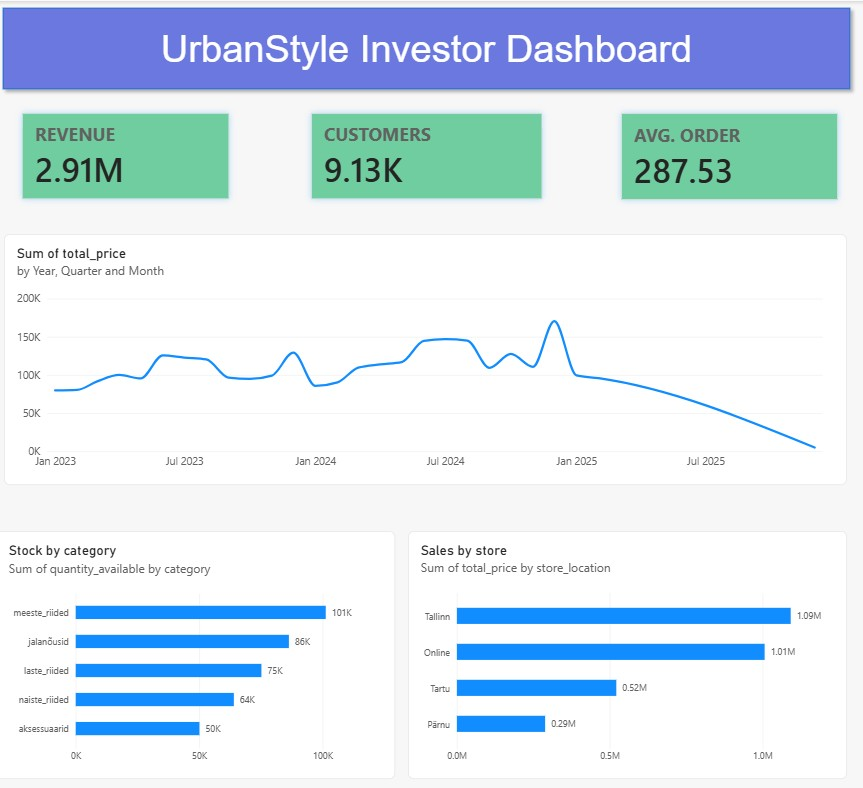

# Week 5 — Visualisation Design

**Client:** UrbanStyle Ltd (fictional Estonian fashion retailer)
**Role:** Junior Data Analyst — Operations view (Liis Koppel) + combined investor view
**Tools:** Power BI Desktop, Supabase (PostgreSQL), SQL

## The problem

Three stakeholders needed different views of the same data. The CEO wanted one
investor-ready page; Operations wanted stock levels and store performance.
My task was the operations view plus the combined investor summary.

## What I built

A single-page dashboard containing:

- Three KPI cards — total revenue, customer count, average order value
- Monthly revenue trend (line chart)
- Sales by store (horizontal bar)
- Stock by category (horizontal bar)

## Design decisions

**KPI cards, top left.** Western reading order starts top-left, so the numbers
an investor cares about most go there. Filters were deliberately kept out of
that position.

**Line chart for revenue over time.** Revenue is continuous across months, and
the connecting line communicates that. A bar chart would imply the months are
separate categories.

**Horizontal bars for stores and stock.** Both are rankings, and the eye compares
bar lengths accurately. Both are sorted descending so the ranking is immediate.

**No pie charts.** Stock by category has five slices with no clean part-of-whole
meaning, and a ranking question is better served by bars.

**Data-ink ratio.** Chart titles were rewritten from field names
("Sum of total_price by store_location") to plain business language
("Sales by store").

## Data quality findings

These shaped the dashboard as much as the design principles did:

- **Sales data effectively ends February 2025.** The table runs to June 2026,
  but after Feb 2025 there are only single-digit stray rows per month. Plotted
  naively, this reads as a business collapse. It is a data completeness issue,
  not a trend.
- **10 inventory rows had negative `quantity_available`.** Filtered out in
  Power Query before charting.
- **`store_location` was blank for online sales.** Relabelled to "Online" so the
  chart is readable without explanation.

## Business interpretation

**Sales by store:** Tallinn and Online together make up about 72% of revenue
(1.09M and 1.01M). Pärnu is smallest at 0.29M, so stock and staffing should be
weighted towards Tallinn and the online warehouse.

**Stock by category:** Menswear holds the most stock at 101K units, accessories
the least at 50K. Stock alone cannot tell us whether levels are correct — the
next step would be comparing stock against sales per category to identify
overstocking or shortages.

## AI use

AI was used as a collaboration partner this week, as the course required.
I used it to check chart-type choices against the business question, to talk
through the data quality issues I found, and for step-by-step help with
unfamiliar Power BI features (Power Query filtering, relationship cardinality).
All business interpretations and design decisions are my own, and I corrected
several AI-suggested interpretations that were not supported by the data.

## Files

- `urbanstyle_week5_dashboard_FATIMA.pbix` — the dashboard
- `week5_queries.sql` — SQL used to explore and validate the data
- `Dashboard.jpg` — screenshot